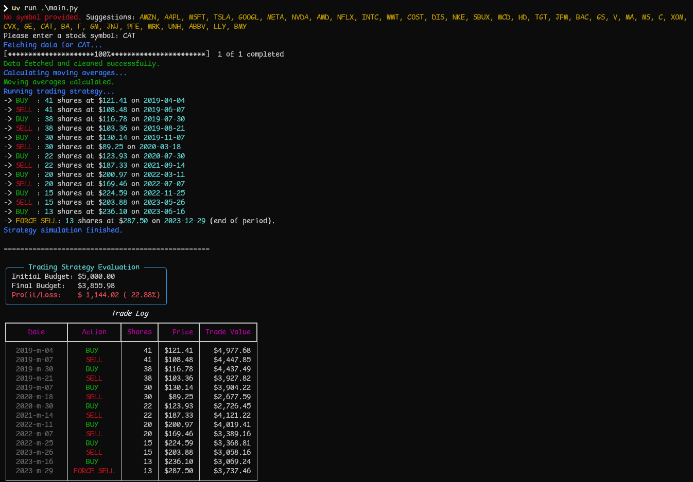
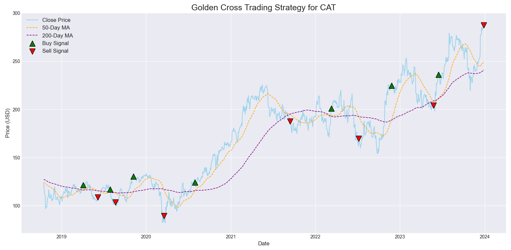

# 💹 Algorithmic Trading Adventure — Task 1

## 📘 Overview
This project simulates an **algorithmic trading strategy** using Python and historical market data.  
It automatically detects **Golden Cross** signals (50-day MA crossing 200-day MA) to **buy** and **sell** stocks, starting with a $5000 budget.

This task is part of the **GTR Task 1** challenge.

---

## ⚙️ Installation & Setup

### 1️⃣ Install [UV Package Manager](https://docs.astral.sh/uv/)

#### For **Windows (PowerShell)**:
```powershell
powershell -ExecutionPolicy ByPass -c "irm https://astral.sh/uv/install.ps1 | iex"
````

#### For **Linux / macOS (bash)**:

```bash
curl -LsSf https://astral.sh/uv/install.sh | sh
```

Verify installation:

```bash
uv --version
```

---

### 2️⃣ Clone the Repository

```bash
git clone https://github.com/Sayemahamed/GTR-Task1.git
cd GTR-Task1
```

---

### 3️⃣ Install Dependencies

Using **uv**:

```bash
uv sync 
```

---

### 4️⃣ Run the Project

Run the main file:

```bash
uv run .\main.py
```

You will be prompted to enter a stock symbol.
Example:

```
No symbol provided. Suggestions: AMZN, AAPL, MSFT, TSLA, GOOGL, META, NVDA, AMD, ...
Please enter a stock symbol: CAT
```


---

## 🧾 Result Screenshots

### 🖥️ Terminal Output



### 📊 Plot Visualization




---

## 🧩 Features

✅ Class-based design for reusability 
✅ Uses `yfinance` for historical data
✅ Cleans and preprocesses missing data
✅ Detects **Golden Cross** and **Death Cross**
✅ Executes simulated buy/sell trades
✅ Evaluates total profit or loss
✅ Generates a clean matplotlib plot with signals

---
## 🧾 License

This project was created as part of **GTR Task 1** for educational purposes.
Author: **Md. Iftaker Ahamed Sayem**
License: **MIT**

---

## 🌐 Repository

🔗 [https://github.com/Sayemahamed/GTR-Task1](https://github.com/Sayemahamed/GTR-Task1)
